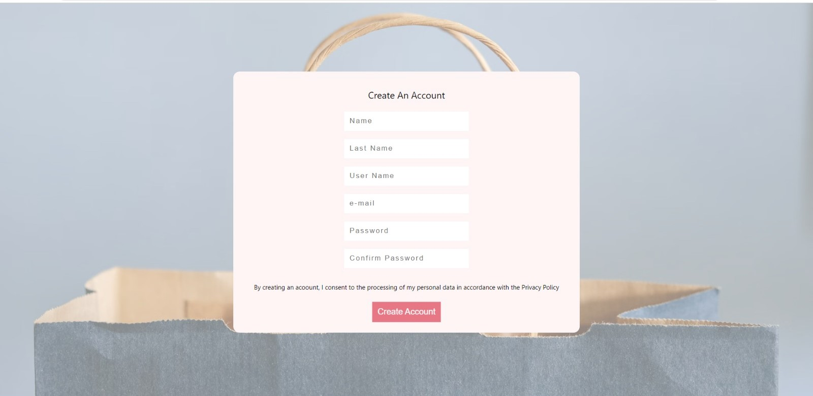

# e-commerce-website
 
### This project includes e-commerce website example. You can;
- Register to website
- Log in 
- Log out
- choose product
- Add to shop cart
- Pay for your products

--- 

### I used;
- React Redux Toolkit
- MongoDB
- Rest API
- Stripe Payment Checkout
- Firebase
- JWT

---

#### Some screenshots for you;
 

    
    

    
    

    

